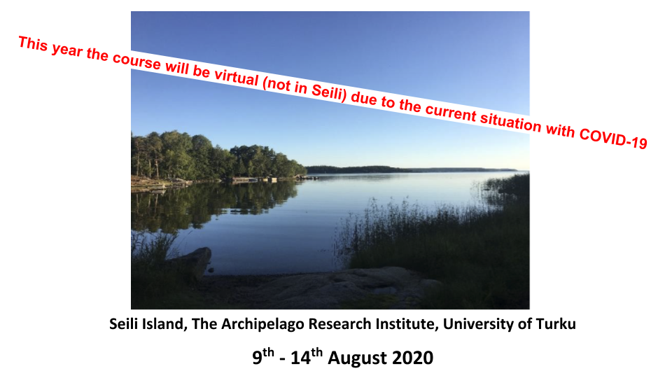
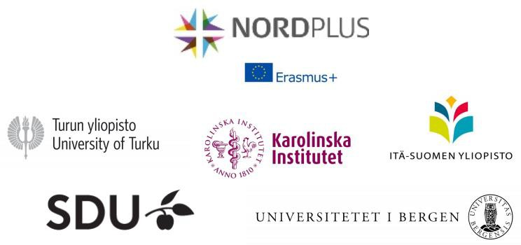

# NordBioMedNet Summer School 2020: Computational Biomedicine - Imaging, machine learning and precision medicine

NordBioMedNet Summer School 2020 is part of the “Open Educational Resources in Computational
Biomedicine (OERCompBiomed) project conducted by the [NordBioMed.org](https://nordbiomed.org/news/summer-school-2019) and funded by [Erasmus+](http://ec.europa.eu/programmes/erasmus-plus/projects/eplus-project-details/#project/bc4e0bdb-aa64-4d5c-a7f2-26d68ec36647)project conducted by the NordBioMed.org and funded by Erasmus+.

NordBioMed is a collaborative network in the field of Biomedicine between the Universities of Turku, Eastern Finland (Kuopio), Bergen, Odense and Karolinska Institutet. The network was originally formed in 2013 to strengthen the individual biomedical teaching programs within the component universities and make them internationally more comparative by providing complementary activities from the partner universities. The network supports both student and teacher mobility, organisers intensive courses and develop virtual online teaching.

**The topic for the 2020 Summer school is computational biomedicine in brain tumours. This year the course will virtual due to the current situation with COVID-19.**

## General information

### Learning aims:

Students will apply their previous knowledge to identify relevant and realistic topics/problems in the field of computational biomedicine. Students will work in groups of 4-5 students, each group is guided by a junior mentor. Based on the course material and guidance during the summer school, each group will develop and present a virtual preclinical research project to solve the selected problems. The final report/assignment which will be prepared individually in virtual work groups after the summer school.

### Contents:
**Before the summer school** 
- preliminary reading and assignments on NordBioMedNet Canvas

**During the summer school** 
- lectures
- team work
- student presentations
- practical exercises

**After the summer school** 
- independent work and virtual team work
- final report and press release

### Course structure
- All course material and information will be found on Canvas (https://ki.instructure.com/courses/4313 needs login)
- Lectures and group activities will be held in Zoom
- Python course material at GitHub (https://github.com/oercompbiomed/Seili-2020)

### Volume: 5 ECTS

University of Turku will award 5 ECTS for all the participants after successful completion of the Summer School. Each participant receives a course certificate and a transcript. However, the final crediting will be done at the home university of each participant, and the home university has a right to change the amount of ECTS awarded.

## Summer School Programme

The Summer School has its start in June and finish in end of September. In June (exact date TBC) a package of pre-assignments will be sent out to participants and project groups will be formed – one student from each participating university in each group.

The week before the summer school starts in August introductory lecture will be held and the first start-up workshop. During the intensive course week online lectures are given with possibilities to interact with teachers. Group work is scheduled to afternoons between 12.00 – 18.00 (CET) for most of the days – estimated at least 4h/day active work in groups is needed. After the course week student groups continue to work with the projects on-line and in virtual meetings. The teams deliver a final report in the end of September (25.9.2020).

Students will work on Canvas platform (Karoliska Institutet) and data will be shared in GitHub. Students are signed in at University of Turku from where 5 ECTS are given upon completion of the course.

#### Pre-assignments in June:

**Bioethics (web-based) containing the following modules:** 
Module 1. Introduction to BioEthicsX 
Module 2. Research ethics in Biomedicine

**Python, R and friends:** 
A short introduction to programming and how to prepare yourself and
your computer for the computational exercises at the Summer School https://rise.articulate.com/share/Y-vw0ZckATqKqyh4u44c8p9YN-UEtr8r

#### Preparation Week: 3rd – 7th of August 2020 (NB – time is given in CET): 

| Time       |  Activity                                                 |    Zoom       |
|------------|-----------------------------------------------------------|---------------|
|**Monday, August 3**|                                                  |               |
|11:00-12:15 | Motivation lecture [[slides](https://docs.google.com/presentation/d/e/2PACX-1vS_bOcV03UCLIdJe6LRDcJVXx4l3PzfP0hktWzgMwe9yalNciQjLP89t-ov-2FQ1Gwnn9rH4zHAture/pub?start=false&loop=false&delayms=3000)] [[recording](https://drive.google.com/file/d/1EVYcT4oJpK8MPR4iwAIFt4hP9FSSAUP-/view?usp=sharing)] :              |  Join in Zoom |
|            | Why are computational skills needed in biomedicine?      |               |
|            | - relevance to uncovering disease mechanisms and for diagnostics |          |
|            | *Arvid Lundervold, University of Bergen*                  |               |
|            | The Seili-2020 GitHub repository and short review of Jupyter notebooks |     |
|            | [[recording](https://drive.google.com/file/d/1DkfjjUTBaFE_LeOktIpYc5QxrzLOMjDb/view?usp=sharing)] (*Peder Lillebostad, Uiniversity of Bergen*) |     |
|12:30-13:30 | Team building activites  (5 groups of students assigned on Canvas)  | Join in Zoom   |
|            | *Karin Hjernø, University of Southern Denmark, Odense*   |          |
|            |                                                          |         |
|**Friday, August 7**|                                                  |               |
|11:00-12:30 | Follow-up on Jupyter notebooks, pre-assignments [[recording](https://drive.google.com/file/d/1MU0Ki_V9NqTRDTyYI-SVNTK3WTxwzilI/view?usp=sharing)] and      | Join in Zoom  |
|           | collaborative writing on Overleaf for group-wise reporting on |         |
|           | the Summer school project "Precision medicine and quantitative |       |
|            | imaging in glioblastoma - a multiscale approach"  [[slides](https://docs.google.com/presentation/d/e/2PACX-1vSSlP3xITYws_qdTqr5uLyOqG2W_HoJNanPYuk8T0bFa_wa3dJM5jPQFlsna2bCZXp2OaIo9d-7HTH-/pub?start=false&loop=false&delayms=3000)]  [[recordning](https://drive.google.com/file/d/1aFKZ8KWNDfZowWbIrvtY-x5lN9J-tV0K/view?usp=sharing)]       |          |
|            | *Peder Lillebostad & Arvid Lundervold, University of Bergen*  |               |

#### Intensive week 10th – 14th of August 2020 (NB – time is given in CET): 

| Time       |  Activity                                                 |    Zoom       |
|------------|-----------------------------------------------------------|---------------|
|**Monday, August 10**|                                                  |               |
|09:00-09:15 | Kick-off for the Summer School 2020                       |  Join in Zoom |
|            | *Lars-Arne Haldosen, Karolinska Institutet, Stockholm*    |               |
|09:15-10:00 | Bioimage informatics and machine learning                 | Join in Zoom  |
|            | *Jussi Tohka, University of Eastern Finland, Kuopio*      |               |
|10:00-10:30 | Coffee in Coffee Room (Zoom)                              | Join in Zoom  |
|10:30-11:15 | Brain cancer – clinical aspects                           | Join in Zoom  |
|            | *Heikki Minn, University and University Hospital, Turku*  |               |
|11:15-12:00 | Glioblastoma – molecular mechanisms                       | Join in Zoom  |
|            | *Maria Gardberg, University and University Hospital, Turku* |               |
| Afternoon  | Project work in teams                                     | Join in Zoom  |
|            |                                                           |               |
|**Tuesday, August 11**|                                                 |               |
|09:00-12:00 | Workshop: Image data analysis - using unsupervised        |  Join in Zoom |
|            | classification to analyse brain cancer [[slides](https://docs.google.com/presentation/d/e/2PACX-1vRFPferC_QH6LSC-SKDphXjAdNB0O67oDg-B7dtg_YOie6foM39UHijs9XfhNDF-hwBXYbtaOcI-8SV/pub?start=false&loop=false&delayms=3000)]  &                   |               |
|            | Neural networks in man and machine [[slides](https://docs.google.com/presentation/d/e/2PACX-1vQsnIaPS6NSfKBm6RAZnMcibfLewWT9C4n4UjaJhuht_we6tgVpN052ZhzuoHZpSODiFUbDsf9pcmXM/pub?start=false&loop=false&delayms=3000)]      |               |
|            | *Arvid Lundervold / Peder Lillebostad, University of Bergen* |               |
|13:00-14:00  | Workshop: Image data analysis cont. - Deep learning       |  Join in Zoom |
|            | *Peder Lillebostad / Arvid Lundervold, University of Bergen* |               |
|             | See also the Kubiac's *Neural networks tutorial for medical image analysis* [[here](https://github.com/Hierakonpolis/NN4Kubiac)] |   |
| Afternoon  | Project work in teams                                     | Join in Zoom  |
|            |                                                           |               |
|**Wednesday, August 12**|                                               |               |
|09:00-12:00 | Workshop: Bioethics                                       |  Join in Zoom |
|            | *Niklas Juth, Karolinska Institutet, Stockholm*           |               |
| Afternoon  | Project work in teams                                     | Join in Zoom  |
|            |                                                           |               |
|**Thursday, August 13**|                                                |               |
|09:00-09:45 | Euro-Bioimaging - Image life, discover the future         |  Join in Zoom |
|            | *Pasi Kankaanpää, University of Turku*                    |               |
|09:45-10:15 | Coffee in Coffee Room (Zoom)                              | Join in Zoom  |
|            |                                                           |               |
|**Career opportunities* | **outside academia - meet the companies in bioimage informatics**||
|10:15-11:00 | Misvik Biology https://www.misvik.com                     | Join in Zoom  |
|            | *Juha Rantala, CEO, Turku*                                |               |
|11:00-11:45 | Aiforia https://www.aiforia.com                           | Join in Zoom  |
|            | *Darshan Kumar, Customer Success Scientist, Helsinki*     |               |
| Afternoon  | Project work in teams                                     | Join in Zoom  |
|            |                                                           |               |
|**Friday, August 14**|                                                  |               |
|09:00-13:00 | Student presentations with feedback                       |  Join in Zoom |

__________________________________________________________________________ 

## Before the summer school
Before the summer school you have some assignments to do. It is up to you to plan when to do this during summer. 

#### 1. *Go through a module of a course in bioethics with focus on basic principles in bioethics* by following the two steps below. 
- Make an account in edX Edge: https://edge.edx.org/register
- Enroll to the module via the link: https://edge.edx.org/courses/course-v1:KIx+KIBioEthicsX 
Niklas Juth from Karolinska Institutet  will work with you on some cases related to the theme of the summer school. 
(for students outside the Summer school, see the edX (KIx) course by Niklas Juth: [The Ethics of Biomedicine](https://www.edx.org/course/the-ethics-of-biomedicine))

#### 2. *Prepare you and your computer for computational analysis*
If you are used to work with computer installations and github you can go directly to the material at github and use the guide for setting up your computer and perform notebook exercises. 

- **Python course material** at https://github.com/oercompbiomed/Seili-2020  – follow the instructions at [Setting up your system](setup.md) (`setup.md`) to get ready

- **Browser** display and functionality might differ between browsers - we recommend using Google [Chrome](https://www.google.com/chrome) on all platforms

- **Jupyter notebooks** are used throughout the course being a web-based framework for developing and presenting code-based projects (take a look at https://youtu.be/HW29067qVWk and https://youtu.be/2eCHD6f_phE for introductions to Jupyter Notebooks).

-  **Test your environment** [Python, Numpy, Pandas, Matplotlib, Nibabel, Biopython and more]: run through this notebook [`test-notebooks/0.0-test-installation.ipynb`](test-notebooks/0.0-test-installation.ipynb) to check that your environment is OK

- Throughout the course you will work with notebooks that contain various material and programming tasks. We recommend that you *make a copy of our notebooks before you are editing them*. In this respect you might adopt the naming convention `my_[name_of_notebook].ipynb`. Remember also to start a new session with a `**git pull**` (things can have changed)

If you are less experienced you may want to visit our interactive course material first (see link below). It contains video instruction on how to set up your computer for the course and introduction to programming as well as the notebooks exercises.  
https://rise.articulate.com/share/Y-vw0ZckATqKqyh4u44c8p9YN-UEtr8r

(It is the **Python, R and Friends** part of our OpenEdx course transformed into a Rise course for the purpose of being pre-course material for the online Summer School). 

#### 3. *Orient yourself in the material for the group project and how to use [LaTeX](https://www.latex-project.org) creating the report document*

- **Project description** (“_Precision medicine and quantitative imaging in glioblastoma – a multiscale approach_“) at [`prj-descr.md`](project/prj-descr.md)

- **LaTeX template for the report** illustrated with a group project report from the previous 2019 Summer School at Seili for which *Prostate Cancer* was the topic (see this [link](https://www.overleaf.com/read/xwjxwcnpzhqv)). We will be using the [Overleaf](https://www.overleaf.com) online, collaborative LaTeX editor (for more information on LaTeX, see [here](https://en.wikipedia.org/wiki/LaTeX) and [here](https://www.tug.org/pracjourn/2007-4/senthil/senthil.pdf) and [here](https://mildopinions.wordpress.com/2008/07/07/why-i-use-latex-in-biology), and for LeTeX templates, see e.g. [here](https://www.overleaf.com/latex/templates/template-for-submissions-to-molecular-systems-biology/kyxgttpbzhht) and [here](https://www.overleaf.com/latex/templates/tagged/academic-journal))

Also, for those of you that have limited knowledge about biology and pathology of brain or have to refresh about this there is a web course on Coursera – for free – covering the above. It is possible to pay a fee if you are interested to have a diploma if you go through the course. See https://www.coursera.org/learn/neurobiology   [[brain tumors](https://www.coursera.org/lecture/neurobiology/brain-tumors-fUcn4)] 

- **Pre reading** 
  - Aldape K et al. Challenges to curing primary brain tumors. Nat Rev Clin Oncol 2019;16:509-520.  [[link](https://www.nature.com/articles/s41571-019-0177-5)]
  
  - Louis DN et al. The 2016 World Health Organization Classification of Tumors of the Central Nervous System: A Summary. Acta Neuropathol 2016;131(6):803-820. [[link](https://link.springer.com/article/10.1007/s00401-016-1545-1)]
  
  - The Brain Atlas https://www.proteinatlas.org/humanproteome/brain 

__________________________________________________________________________ 
### Project related

(see also [here](./project/prj-descr.md))

**Brain tumors & Neuroimaging** (some pointers)

- Abd-Ellah MK et al. A review on brain tumor diagnosis from MRI images: Practical implications, key achievements, and lessons learned. Magnetic Resonance Imaging 2019;61:300-318. [[link](https://www.sciencedirect.com/science/article/pii/S0730725X18304302)]
- Hamid MAA, Khan NA. Investigation and Classification of MRI Brain Tumors Using Feature Extraction Technique. Journal of Medical and Biological Engineering 2020;40:307–317. [[link](https://link.springer.com/article/10.1007/s40846-020-00510-1)]
- Lohmann P et al. PET/MRI Radiomics in Patients With Brain Metastases. Front. Neurol., 07 February 2020. [[link](https://www.frontiersin.org/articles/10.3389/fneur.2020.00001/full)]
- Tiwari A et al. Brain tumor segmentation and classification from magnetic resonance images: Review of selected methods from 2014 to 2019. Pattern Recognition Letters 2020;131:244-260. [[link](https://www.sciencedirect.com/science/article/pii/S016786551930340X)]
- Nadeem MW et al. Brain Tumor Analysis Empowered with Deep Learning: A Review, Taxonomy, and Future Challenges. Brain Sci 2020;10(2):118. [[link](https://www.ncbi.nlm.nih.gov/pmc/articles/PMC7071415)]

- Brain Tumor Segmentation (BraTS) Challenge 2020: Scope  (MICCAI2020) - Center for Biomedical Image Computing & Analytics, Perelman School of Medicine, University of Pennsylvania [[link](https://www.med.upenn.edu/cbica/brats2020)] [[Data description](https://www.med.upenn.edu/cbica/brats2020/data.html)]

**Brain tumors & Artificial intelligence** (some pointers)

- NCI: Artificial Intelligence Expedites Brain Tumor Diagnosis during Surgery. 2020 Feb 12. [[link](https://www.cancer.gov/news-events/cancer-currents-blog/2020/artificial-intelligence-brain-tumor-diagnosis-surgery#:~:text=Now%2C%20a%20new%20study%20shows,tumor%20tissue%20from%20healthy%20tissue)]
- Hollon TC et al. Near Real-Time Intraoperative Brain Tumor Diagnosis Using Stimulated Raman Histology and Deep Neural Networks. Nature Medicine 2020;26(1):52-58. [[link](https://www.nature.com/articles/s41591-019-0715-9)]  [[GitHub repository](https://github.com/toddhollon/srh_cnn)] [[video](https://labblog.uofmhealth.org/health-tech/artificial-intelligence-improves-brain-tumor-diagnosis?utm_source=youtube&utm_medium=organic&utm_campaign=ai_neuro&utm_content=labblog)]
- Yogananda CGB et al. A novel fully automated MRI-based deep-learning method for classification of IDH mutation status in brain gliomas. Neuro-Oncology 2020;22(3):402–411. [[link](https://watermark.silverchair.com/noz199.pdf?token=AQECAHi208BE49Ooan9kkhW_Ercy7Dm3ZL_9Cf3qfKAc485ysgAAAsQwggLABgkqhkiG9w0BBwagggKxMIICrQIBADCCAqYGCSqGSIb3DQEHATAeBglghkgBZQMEAS4wEQQM_l0qCe0X3j7sec-zAgEQgIICd-ksYewnKy45LqXTHXhHOAzzJHK3d4tFLFHnfz8trcRb48Op3XkTRQnJTc68VoXcq-91GkhszdO1gk8fttfzAwFwW5XMt_eLL4rqoKEbl2mNWd3wzyvmluUTIWhhmnLFvEWPTHh6PW1CpBxGu_T3RwFvulqSVi-DWv_K37kCY4DY-5nROmyiX6ZI0G77UhPodnbG0S8LjAz02cK0xfz2fpahloSHSm8TfTzWz_AlUKLJEKmdNMVQuy9x7uhAHVYQwf_sS6Q2gAz09ETmmfO3DzwPA34F_ss3vszaphRudvW1aMteB9K6eqWYmqOiMfI4r8LFM_fzoLzLk9JvtQJv8KjJXkOorVG7oVFh-jiIrOnQgV1IJ0xKYLv1maRksi6J4SmpO0gDY5XXVH8Vih99007mvG_nr-E7UtFz5dUUyzERxW6O_1dvClEjpokBpDP-JBxyOwibwNQobzV8c4sT7n99wIVWOgwwJNEKADqHYECBuEH2wO0NT0_pBlJx0JAJQL8i-dg949euJo_gKqq8DHOymDDkaEd4o-QXgsJ5bMZiZ3iiH-xUAlJsdh2UxLLGCEKezghbLN40_qf_yVhH-NLM_8JbTI-nVuxH2a-dIaHAu0Q_YmHpItMRzBYxNrud99epxTorOe1RgKGhr2Hp8Xb7EGYvJNDC-4ymCTWlB2pET8NudI1e7YZBRH9UDmc6GYJbZnryuYbpWUvR5_rm7FicF8-gysEn9cIVW6vycxsLPompsjQhXrkLJWYOCLBt1P1_blJVk8ASUpzOTPNjhngR4ZfGdgs8_aRF-15kzdsqDA2Id1QqMwZsXRL8PtydJWMP3HXkM3k)]
- Kickinereer P et al. Automated quantitative tumour response assessment of MRI in neuro-oncology with artificial neural networks: a multicentre, retrospective study. The Lancet Oncology 2019;20(5):728-740. [[link](https://www.thelancet.com/journals/lanonc/article/PIIS1470-2045(19)30098-1/fulltext)]

**Brain tumors & software and data** (some pointers for illustration and inspiration)

- Brain Tumor Segmentation | Papers With Code [https://paperswithcode.com/task/brain-tumor-segmentation/latest]
- Akshay Kumaar M. Brain Tumor Classification (using ResNet50 and Google Colab)  [https://github.com/aksh-ai/brain_tumor_classification]
- Joohyun Lee. BraTs (Brain Tumor Segmentation) [https://github.com/cv-lee/BraTs]
- Bakas S et al. Advancing The Cancer Genome Atlas glioma MRI collections with expert segmentation labels and radiomic features. Scientific Data 2017;4, Article number: 170117 [https://www.nature.com/articles/sdata2017117] [[pdf](https://www.nature.com/articles/sdata2017117.pdf)] 
*Excerpt*: Considering the value of big data and the potential of publicly available datasets for increased reproducibility of scientific findings, the National Cancer Institute (NCI) of the National Institutes of Health (NIH) created TCGA ([cancergenome.nih.gov](https://www.cancer.gov/about-nci/organization/ccg/research/structural-genomics/tcga)) and [TCIA](https://link.springer.com/article/10.1007/s10278-013-9622-7) (www.cancerimagingarchive.net). TCGA is a multi-institutional comprehensive collection of various molecularly characterized tumor types, and its data are available in NCI’s Genomic Data Commons portal ([gdc-portal.nci.nih.gov](https://portal.gdc.cancer.gov)). Building upon NIH’s investment in TCGA, the NCI’s Cancer Imaging Program approached sites that contributed tissue samples, to obtain corresponding de-identified routine clinically-acquired radiological data and store them in TCIA. These repositories make available multi-institutional, high-dimensional, multi-parametric data of cancer patients, allowing for radiogenomic analysis. 
- Lundervold AS, Lundervold A. An overview of deep learning in medical imaging focusing on MRI. Zeitschrift fur Medizinische Physik. 2019;29(2):102-127. [[link](https://www.sciencedirect.com/science/article/pii/S0939388918301181)] [[pdf](https://reader.elsevier.com/reader/sd/pii/S0939388918301181?token=F0F5572A8CA576BB20A27E381932486EAD2ECEAA5FEE098EAE183438F8BA7A989E8046160DDE10526E3698BD6D27784A)]

**Ethics of artificial intelligence and machine learning** (some pointers)
- Wikipedia [https://en.wikipedia.org/wiki/Ethics_of_artificial_intelligence]
- Rigby MJ. Ethical Dimensions of Using Artificial Intelligence in Health Care. AMA Journal of Ethics, Feb 2019 [https://journalofethics.ama-assn.org/article/ethical-dimensions-using-artificial-intelligence-health-care/2019-02]
- Morley J, Machado C, Burr C et al. The Debate on the Ethics of AI in Health Care: A Reconstruction and Critical Review (November 13, 2019). [https://ssrn.com/abstract=3486518]
- Bostrom N, Yudkowsky E. The Ethics of Artificial Intelligence. In Frankish K, Ramsey W (ed) Cambridge Handbook of Artificial Intelligence, CUP 2014   [https://intelligence.org/files/EthicsofAI.pdf]
- Ethics of Artificial Intelligence and Robotics. First published Apr 30, 2020. Stanford Encyclopedia of Philosophy [https://plato.stanford.edu/entries/ethics-ai]
- Gibney W. The battle for ethical AI at the world’s biggest machine-learning conference. Nature news 20 Jan 2020 [https://www.nature.com/articles/d41586-020-00160-y]
- Ethics of AI in Radiology. European and North America Multisociety Statement 2019 [https://www.acr.org/-/media/ACR/Files/Informatics/Ethics-of-AI-in-Radiology-European-and-North-American-Multisociety-Statement--6-13-2019.pdf]
- Vollmer S, Mateen BA, Bohner G et al. Machine learning and artificial intelligence research for patient benefit: 20 critical questions on transparency, replicability, ethics, and effectiveness. BMJ 2020;368:l6927. [https://www.bmj.com/content/368/bmj.l6927]

__________________________________________________________________________ 

SPONSORS 

__________________________________________________________________________ 
